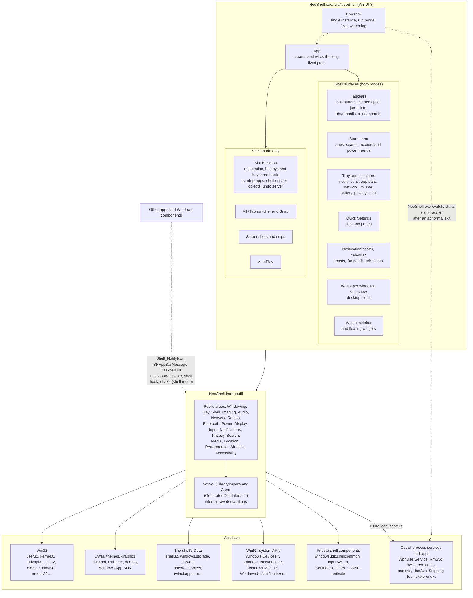
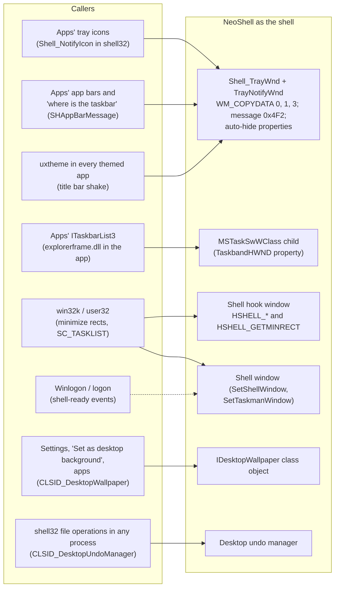

# NeoShell architecture

How NeoShell is put together, and every part of Windows it talks to: which DLL, what NeoShell uses from it and for
what. The features themselves are specified in [design.md](design.md) and the area files in [design/](design/); this
document links to them for the *why*.

## Introduction

NeoShell replaces `explorer.exe` as the Windows 11 shell: wallpaper and desktop icons, the taskbar with its system
tray and indicators, Quick Settings, the notification center, the Start menu, Alt+Tab and Snap, screenshots,
AutoPlay and a widget sidebar. It is one unpackaged, self-contained WinUI 3 app on .NET 10.

It runs in one of two modes, chosen at start-up ([Application lifecycle](design/lifecycle.md#application-lifecycle)):

1. **Alongside Explorer** (development default): an Explorer shell exists (`GetShellWindow()` returns a window).
   NeoShell's taskbar and sidebar reserve app bar space next to Explorer's; Explorer keeps the desktop, the system
   tray, the Win key and every contract below.
2. **As the shell**: there is no shell window. NeoShell registers itself as the shell window, owns `Shell_TrayWnd`,
   shows the wallpaper, registers hotkeys and a keyboard hook, runs startup apps and shell service objects, serves
   the contracts in [What NeoShell provides to Windows](#what-neoshell-provides-to-windows), and leaves a watchdog
   that starts Explorer if it dies.

Two projects:

- **`src/NeoShell`** — the WinUI app: windows, controls, view models and app logic. It never declares a P/Invoke.
- **`src/NeoShell.Interop`** — every call into Windows that isn't the BCL or WinUI: Win32 through `[LibraryImport]`
  (`Native/`), COM through source-generated `[GeneratedComInterface]` (`Com/`), WinRT system APIs, and OLE DB search.
  Raw declarations are `internal`; the public surface is small classes with .NET types and .NET events, `nint` for
  window handles.

So every row of the tables below is called from `NeoShell.Interop`. The few WinRT types the app project touches
itself are WinUI plumbing (drag-and-drop data, a compositor brush, number formatting), noted where they appear.

## Architecture

Walkthrough:

- **`Program`** keeps one instance per session (a named mutex; `/exit` posts a registered message to the running
  one), decides the run mode, and in shell mode registers the shell window at once and starts the watchdog
  (`NeoShell.exe /watch <pid>`), which starts `explorer.exe` if NeoShell ends any way but cleanly.
- **`App`** builds the long-lived parts by hand (no DI): settings, `Wallpaper` (wallpaper windows, slideshow, desktop
  icons, the `IDesktopWallpaper` service; shell mode only), `Taskbars` (a taskbar per monitor with the tray host,
  indicators, Start, Quick Settings, the notification center, toasts and focus sessions), the widget `Sidebar`, and in
  shell mode `ShellSession` (hotkeys and the keyboard hook, Alt+Tab, Snap, snips, AutoPlay, shell service objects,
  the undo server, startup apps and session end).
- **`NeoShell.Interop`** turns each Windows facility into a small .NET class (`AudioEndpoint.Changed`,
  `TrayHost`, `WindowEvents`, `SystemSetting`…). Callbacks from other threads (Core Audio, WinRT, WNF) are raised as
  .NET events and marshalled to the UI thread by the app with `DispatcherQueue.TryEnqueue`; message-only windows,
  subclasses and hooks are created on the UI thread and need no marshalling.
- **Windows** is reached at six layers: plain Win32; DWM and themes; the shell's own DLLs (shell32 and
  windows.storage, mostly in-process COM); WinRT system APIs; private components Explorer itself uses (undocumented
  WinRT classes, Settings handlers, WNF state, exports by ordinal); and out-of-process services reached through COM
  local servers or that sit behind the APIs above.
- **Back into NeoShell** (dotted): as the shell NeoShell owns the windows and class objects that other apps and
  Windows look up to talk to the shell. The second diagram shows them.

## Windows components

Every DLL NeoShell's code calls, creates a COM or WinRT class from, or loads, appears once below. "Public" means
documented in the Windows SDK; "private" means undocumented, learned from symbols and Explorer's own use (the source
file says how). The Windows App SDK and the BCL's own use of Windows (registry through `Microsoft.Win32.Registry`,
processes, files) aren't listed function by function.

### Win32 system DLLs

| DLL | What it is in Windows | What NeoShell uses | What for | Status |
|---|---|---|---|---|
| `user32.dll` | Windows, messages, input, desktop | Window classes and message-only windows, `SetWindowPos`/`SetWindowRgn`/`SetLayeredWindowAttributes`, `EnumWindows` and window queries, `SetWinEventHook`, `RegisterShellHookWindow`, `SetWindowsHookEx` (`WH_KEYBOARD_LL`, `WH_CBT`), `RegisterHotKey`, `SendInput`, monitors and `GetDpiForWindow`, `QueryDisplayConfig`/`SetDisplayConfig`, `GetAutoRotationState`, `SystemParametersInfo` (work area, minimized metrics, wallpaper, sticky keys, message duration), clipboard, popup menus, `EndTask`, `LockWorkStation`, `ExitWindowsEx`, `ChangeWindowMessageFilterEx`, `GetShellWindow`/`SetShellWindow`/`SetTaskmanWindow`; `IsWindowArranged`; undocumented `ApplyWindowAction`, and ordinals 2509 `AcquireIAMKey` / 2510 `EnableIAMAccess` | Every surface and window tracking ([Window tracking](design/taskbar.md#window-tracking)); hotkeys and hook ([Hotkeys](design/hotkeys.md#hotkeys-shell-mode-only)); shell registration ([Shell mode](design/lifecycle.md#shell-mode-shellsession)); arranged snaps animated by DWM ([Window snapping](design/windows.md#window-snapping-windowsnapping-shell-mode)); Win+P and rotation lock ([Tiles](design/quick-settings.md#tiles)); End task ([Task buttons](design/taskbar.md#task-buttons)) | Public, plus private `ApplyWindowAction` and ordinals 2509/2510 |
| `kernel32.dll` | Processes, threads, files, memory, locale | `OpenProcess`, `QueryFullProcessImageName`, `GetApplicationUserModelId`, `GetPackagesByPackageFamily`, `OpenThread` (end of a window's thread), `OpenEvent`/`SetEvent`, `CreateFile`/`DeviceIoControl`/`GetVolumeInformation`, `VirtualQuery`, `Global*` (clipboard), `GlobalMemoryStatusEx`, `GetSystemPowerStatus`, `GetTimeFormatEx`/`GetLocaleInfoEx`, `WTSGetActiveConsoleSessionId` | Window identity for grouping ([Window tracking](design/taskbar.md#window-tracking)); shell-ready events ([Shell mode](design/lifecycle.md#shell-mode-shellsession)); bounds checks on shared memory ([Thumbnail toolbars](design/taskbar-apps.md#progress-overlay-badges-thumbnail-toolbars)); optical drive names and volumes ([AutoPlay](design/autoplay.md#autoplay-shell-mode-only-autoplay-interop-shellautoplay-volumearrivals-opticaldrives)); clock text ([Clock](design/indicators.md#clock-and-notification-bell-taskbarclock-clocksettings-clockdisplay-unit-tested)); memory figure ([Widgets](design/widgets.md#the-widgets)) | Public |
| `gdi32.dll` | GDI drawing | `BitBlt`, `GetDIBits`, `GetObject`, DCs and bitmaps, `CreateRectRgn`/`CreateRoundRectRgn`/`CombineRgn` | Screen pictures ([Screenshots](design/capture.md#screenshots-capture)); icon pixels (`IconBitmap`); window regions (`WindowRegion`) | Public |
| `advapi32.dll` | Security, registry, shutdown | `OpenProcessToken`/`GetTokenInformation`/`GetSidSubAuthority` (integrity level), `LookupPrivilegeValue`/`AdjustTokenPrivileges`, `InitiateShutdown`, `LsaIsUserArsoEnabled`/`LsaIsUserArsoAllowed`, `RegNotifyChangeKeyValue`, `RegQueryInfoKey`, `RegLoadAppKey`/`RegQueryValueEx`/`RegSetValueEx` | Restart and shut down with "sign in after restart" ([Power menus](design/account-and-power-menus.md#power-menus-poweritems-interop-shellpoweroptions-shellpower)); following Explorer's registry settings live (`RegistryWatcher`); AutoPlay choice order ([AutoPlay](design/autoplay.md#autoplay-shell-mode-only-autoplay-interop-shellautoplay-volumearrivals-opticaldrives)); Snipping Tool's settings hive ([Snips](design/capture.md#snips-winshifts-and-print-screen-screensnip-sniptoolbar-shell-mode)); elevated windows | Public |
| `ole32.dll` | COM runtime | `CoCreateInstance`, `CoRegisterClassObject`/`CoRevokeClassObject`, `GetRunningObjectTable`/`CreateClassMoniker`, `RegisterDragDrop`/`RevokeDragDrop`, `PropVariantClear` | Every COM class in these tables; serving `IDesktopWallpaper` ([IDesktopWallpaper](design/wallpaper.md#idesktopwallpaper-wallpaperservice-desktopwallpaperserver)); apps' `IQueryCancelAutoPlay` ([AutoPlay](design/autoplay.md#autoplay-shell-mode-only-autoplay-interop-shellautoplay-volumearrivals-opticaldrives)); dropping on the desktop ([Desktop icons](design/desktop-icons.md#desktop-icons-desktop)) | Public |
| `combase.dll` | WinRT runtime core | `WindowsCreateString`/`WindowsDeleteString`/`WindowsGetStringRawBuffer` (HSTRING), `RoGetActivationFactory` | Activating the undocumented WinRT classes, which have no metadata (`Combase.GetActivationFactory`); HSTRINGs for Settings handlers | Public |
| `comctl32.dll` | Common controls | `SetWindowSubclass`, `RemoveWindowSubclass`, `DefSubclassProc` | Seeing WinUI windows' messages (`WindowSubclass`), as WinUI exposes no WndProc ([Technical decisions](design.md#technical-decisions)) | Public |
| `secur32.dll` | Security support provider | `GetUserNameEx(NameDisplay)` | The user's display name ([Account menu](design/account-and-power-menus.md#account-menu-startmenuwindow-accountflyout-interop-shellaccountmenu)) | Public |
| `netapi32.dll` | Network management (accounts) | `NetUserEnum`, `NetUserGetInfo` (level 24: Microsoft account), `NetApiBufferFree` | Other accounts and the Microsoft account email ([Account menu](design/account-and-power-menus.md#account-menu-startmenuwindow-accountflyout-interop-shellaccountmenu)) | Public |
| `wtsapi32.dll` | Remote Desktop / session API | `WTSEnumerateSessions`, `WTSQuerySessionInformation`, `WTSDisconnectSession`, `WTSFreeMemory` | Which accounts are signed in; Switch user ([Account menu](design/account-and-power-menus.md#account-menu-startmenuwindow-accountflyout-interop-shellaccountmenu), [Power menus](design/account-and-power-menus.md#power-menus-poweritems-interop-shellpoweroptions-shellpower)) | Public |
| `winsta.dll` | Window station / session client | `WinStationConnectAndLockDesktop` | Switching to another signed-in account's session ([Account menu](design/account-and-power-menus.md#account-menu-startmenuwindow-accountflyout-interop-shellaccountmenu)) | Private |
| `dsreg.dll` | Device registration (Entra join) | `DsrIsDeviceJoined` | Whether a restart signs the user back in, as Explorer decides it ([Power menus](design/account-and-power-menus.md#power-menus-poweritems-interop-shellpoweroptions-shellpower)) | Private |
| `wintrust.dll` | Signature verification | `WTGetSignatureInfo` | "Published by …" under an AutoPlay choice ([AutoPlay](design/autoplay.md#autoplay-shell-mode-only-autoplay-interop-shellautoplay-volumearrivals-opticaldrives)) | Public |
| `cabinet.dll` | Compression API | `CreateDecompressor`, `Decompress`, `CloseDecompressor` (LZMS) | Reading Start's `AllAppCategoryMappings` for the All list's categories ([Start menu](design/start-menu.md#start-menu-startmenu)) | Public |

### The shell's DLLs

| DLL | What it is in Windows | What NeoShell uses | What for | Status |
|---|---|---|---|---|
| `shell32.dll` (much of it forwarded to `windows.storage.dll`) | The shell's API and objects | `SHAppBarMessage`, `SHGetPropertyStoreForWindow`, `SHGetKnownFolderPath`, `SHCreateItemFromParsingName`/`SHCreateItemFromIDList`/`SHParseDisplayName`/`SHGetIDListFromObject`/`SHCreateShellItemArrayFromIDLists`/`IL*`, `SHGetDesktopFolder` (`IShellFolder`, `IContextMenu3`, `IDropTarget`), `IShellItem`/`IShellItemImageFactory`/`IPropertyStore`, `SHGetStockIconInfo`, `SHDefExtractIcon`, `SHQueryUserNotificationState`, `ShellExecuteEx`, `SHOpenFolderAndSelectItems`; ordinal 61 `RunFileDlg`; `SHELL32_SHGetThreadUndoManager`, `SHCreateLocalServerRunDll`; classes UserAssist, Shell Drag and Drop helper (`IDropTargetHelper`), Undo/Redo commands (`IExplorerCommand`); string resources | App bars alongside Explorer ([Window](design/taskbar.md#window), [Sidebar](design/widgets.md#sidebar-and-floating-widgets)); the app catalog, icons and launching ([Start menu](design/start-menu.md#start-menu-startmenu)); desktop items, menus, drag and drop, undo ([Desktop icons](design/desktop-icons.md#desktop-icons-desktop)); Win+R ([Hotkeys](design/hotkeys.md#hotkeys-shell-mode-only)); launch history (UserAssist) for All's order of use; window AppUserModelIDs ([Window tracking](design/taskbar.md#window-tracking)) | Public, plus private ordinal 61, the undo exports, UserAssist and `IShellUndoUnit` |
| `windows.storage.dll` | The shell's storage/namespace core | Class Shortcut (`IShellLinkW`, `IPersistStream`); classes AutomaticDestinationListBoth `{656E51BD-…}` (`IAutomaticDestinationList`: an app's pinned, recent and frequent items, pinning, unpinning, removing) and DestinationListBoth `{38FE0CF4-…}` (`IInternalCustomDestinationList`: removing from an app's own categories), as Explorer's jump list broker uses them; WinRT `StorageFile`/`StorageFolder` (app project, for WinUI drag and drop); optical drive name strings | Jump lists and their pins ([Jump lists](design/taskbar-apps.md#jump-lists)); dragging desktop icons out ([Desktop icons](design/desktop-icons.md#desktop-icons-desktop)); drive names ([AutoPlay](design/autoplay.md#autoplay-shell-mode-only-autoplay-interop-shellautoplay-volumearrivals-opticaldrives)) | Public, plus the two private jump list classes and interfaces |
| `shlwapi.dll` | Shell light-weight utilities | `SHCreateMemStream`, `IStream_Size`/`IStream_Reset`/`IStream_Read`, `StrCmpLogicalW`, `SHLoadIndirectString`, `AssocGetPerceivedType`, `SHLockShared`/`SHUnlockShared`, `IsOS` | Jump list links; natural sort; `@dll,-id` and `ms-resource:` strings; AutoPlay content; shared memory of app bar and thumbnail toolbar messages ([App bars](design/tray.md#app-bars-trayappbarscs-trayappbarlayoutcs-interop-trayappbarmessagecs)); fast user switching and domain membership for the account menu | Public |
| `shcore.dll` | Shell core (DPI, streams) | `GetDpiForMonitor`; WinRT `InMemoryRandomAccessStream` | Per-monitor DPI (`DisplayMonitor`); decoding pictures ([Widgets](design/widgets.md#the-widgets)) | Public |
| `stobject.dll` | Explorer's "SysTray" shell service object host | Class SysTray `{35CEC8A3-…}`, `IOleCommandTarget::Exec(CGID_ShellServiceObject, OPEN/CLOSE)`. It loads, in NeoShell's process, the registered shell service objects (SndVolSSO, dxp, Windows.CloudStore, Windows.FileExplorer.Common, wpdshserviceobj, cscui, srchadmin, shdocvw, SyncCenter, bthprops, ActionCenter, hcproviders…) | Safely Remove Hardware, Bluetooth pairing prompts, Sync Center and the rest ([Shell service objects](design/lifecycle.md#shell-service-objects-shell-mode-only-shellsession-interop-shellshellserviceobjectscs)) | Private (class and command IDs) |
| `twinui.appcore.dll` | App model activation | Class Application Activation Manager (`IApplicationActivationManager`) | Starting packaged apps without Explorer's `shell:AppsFolder` handler ([Start menu](design/start-menu.md#start-menu-startmenu)) | Public |
| `twinapi.appcore.dll` | App model runtime | Class PackageDebugSettings (`IPackageDebugSettings`) | Ending a packaged app's processes (End task) ([Task buttons](design/taskbar.md#task-buttons)) | Public |
| `StartTileData.dll` | Start's layout store (behind `Export-StartLayout`) | `IStartLayoutCmdlet` | Reading the apps pinned to Explorer's Start ([Start menu](design/start-menu.md#start-menu-startmenu)) | Private |
| `twinui.dll` | Explorer's immersive UI | String resources only (`@twinui.dll,-…`) | AutoPlay's texts, as Windows words them ([AutoPlay](design/autoplay.md#autoplay-shell-mode-only-autoplay-interop-shellautoplay-volumearrivals-opticaldrives)) | Private (resource IDs) |
| `oledb32.dll` | OLE DB core services | Through `System.Data.OleDb` | Running Windows Search queries ([Start menu](design/start-menu.md#start-menu-startmenu)) | Public |
| `tquery.dll` | Windows Search query provider (`Search.CollatorDSO`) | The OLE DB provider the queries run against; `ISearchQueryHelper` builds their SQL | Start's file results ([Start menu](design/start-menu.md#start-menu-startmenu)) | Public |
| Shell extensions (third-party DLLs) | Context menu handlers, icon and thumbnail providers registered with the shell | Loaded in-process by shell32 through `IContextMenu3` and `IShellItemImageFactory` | Explorer's menus on desktop icons, the desktop and Start's apps; icons and thumbnails ([Desktop icons](design/desktop-icons.md#desktop-icons-desktop)) | Public (shell extension interfaces) |

### DWM, themes and graphics

| DLL | What it is in Windows | What NeoShell uses | What for | Status |
|---|---|---|---|---|
| `dwmapi.dll` | Desktop Window Manager API | `DwmRegisterThumbnail`/`DwmUpdateThumbnailProperties`/`DwmQueryThumbnailSourceSize`/`DwmUnregisterThumbnail`, `DwmSetWindowAttribute` (corners, border colour, `DWMWA_CLOAK`, excluded from peek), `DwmGetWindowAttribute` (frame bounds, cloaked, caption button bounds), `DwmFlush`, `DwmEnableBlurBehindWindow`; ordinal 113 `DwmpActivateLivePreview` | Live thumbnails, Alt+Tab and Snap Assist ([Thumbnails](design/taskbar-apps.md#thumbnails), [Window switcher](design/windows.md#window-switcher-switcher)); the maximize button for Snap layouts ([The flyout](design/windows.md#the-flyout-hover-and-winz-snaplayoutswindow-maximizebuttonhover-maximizebutton)); cloaked windows left out of the taskbar; Aero Peek (`Peek`) | Public, plus private ordinal 113 |
| `uxtheme.dll` | Visual styles and Windows 8's immersive colours | Ordinal 86 `IsValidShakeWindow`; ordinals 95 `GetImmersiveColorFromColorSetEx`, 96 `GetImmersiveColorTypeFromName`, 98 `GetImmersiveUserColorSetPreference` | Title bar shake and Win+Home ([Window](design/taskbar.md#window)); the Windows 8 style AutoPlay flyout's colours ([AutoPlay](design/autoplay.md#autoplay-shell-mode-only-autoplay-interop-shellautoplay-volumearrivals-opticaldrives)) | Private (ordinals) |
| `dcomp.dll` | System compositor (`Windows.UI.Composition`) | `Windows.UI.Composition.Compositor` colour brushes (app project) | See-through and tinted backdrops (`ShellBackdrop`; [Technical decisions](design.md#technical-decisions)) | Public |
| `Windows.Graphics.dll` | WinRT imaging (WIC) | `BitmapDecoder`, `BitmapEncoder` | PNG screenshots ([Screenshots](design/capture.md#screenshots-capture)); pictures and app logos ([Widgets](design/widgets.md#the-widgets)) | Public |
| Windows App SDK (`Microsoft.UI.Xaml.dll`, `Microsoft.UI.Windowing.Core.dll`, `CoreMessagingXP.dll`…, shipped self-contained with NeoShell) | WinUI 3 and its windowing | Every surface: XAML, `AppWindow`, `DesktopAcrylicController`/`MicaController`, `DispatcherQueue` | All the UI ([WinUI windows as shell surfaces](design.md#winui-windows-as-shell-surfaces)) | Public |

### Audio, devices, network and input

| DLL | What it is in Windows | What NeoShell uses | What for | Status |
|---|---|---|---|---|
| `MMDevApi.dll` | Core Audio device API | Class MMDeviceEnumerator: `IMMDeviceEnumerator`, `IMMNotificationClient`, `IAudioEndpointVolume`(+callback), `IAudioSessionManager2`/`IAudioSessionControl2`, `IDeviceTopology`/`IConnector`/`IPart` → `IKsControl` | Volume and mute, microphone ([Volume](design/indicators.md#volume)); the per-app mixer and Sound output page ([Pages](design/quick-settings.md#pages)); connecting Bluetooth audio through its KS filter (`BluetoothAudio`) | Public |
| `AudioSes.dll` | Audio session client | Class PolicyConfigClient (`IPolicyConfig::SetDefaultEndpoint`) | Choosing the sound output ([Pages](design/quick-settings.md#pages)) | Private |
| `winmm.dll` | Multimedia (legacy) | `PlaySound` | The beep when a volume slider is let go, as a system sound ([Volume](design/indicators.md#volume)) | Public |
| `powrprof.dll` | Power management | `GetPwrCapabilities`, `SetSuspendState`, `PowerSettingRegisterNotification` (`GUID_ENERGY_SAVER_STATUS`), `PowerGetActiveScheme`, `PowerReadACValueIndex`/`PowerReadDCValueIndex` | Sleep and hibernate ([Power menus](design/account-and-power-menus.md#power-menus-poweritems-interop-shellpoweroptions-shellpower)); energy saver ([Battery and energy saver](design/indicators.md#battery-and-energy-saver)); pausing the slideshow on battery ([Slideshow](design/wallpaper.md#slideshow-slideshow)) | Public |
| `pdh.dll` | Performance counters | `PdhOpenQuery`, `PdhAddEnglishCounter`, `PdhCollectQueryData`, `PdhGetFormattedCounterValue`/`Array` | CPU, GPU and disk use in the resources widget ([Widgets](design/widgets.md#the-widgets)) | Public |
| `hid.dll` | HID class client | `HidD_GetHidGuid`, `HidD_GetAttributes`, `HidD_GetPreparsedData`, `HidP_GetCaps`, `HidD_SetFeature`/`GetFeature`/`GetInputReport`, `HidD_GetProductString` | Batteries of Razer mice and the Audeze Maxwell ([Widgets](design/widgets.md#the-widgets)) | Public (device protocols are the vendors') |
| `cfgmgr32.dll` | Configuration manager | `CM_Get_Device_Interface_List(_Size)` | Finding those HID devices | Public |
| `BluetoothApis.dll` | Bluetooth API | `BluetoothDisconnectDevice` | Disconnecting a device from the Bluetooth page ([Pages](design/quick-settings.md#pages)) | Public |
| `rasapi32.dll` | Remote Access (VPN) | `RasEnumConnections`, `RasHangUp` | The VPN page's connections and Disconnect ([Pages](design/quick-settings.md#pages)) | Public |
| `msctf.dll` | Text Services Framework | Class TF_InputProcessorProfiles: `ITfInputProcessorProfileMgr`, `ITfInputProcessorProfiles` | The enabled keyboard layouts and IMEs ([Input indicator](design/indicators.md#input-indicator-trayinputswitchpanel-interop-inputinputmethods)) | Public |

### WinRT system APIs

| DLL | What it is in Windows | What NeoShell uses | What for | Status |
|---|---|---|---|---|
| `Windows.Networking.Connectivity.dll` | Network status | `NetworkInformation`, `ConnectionProfile`, `NetworkAdapter` | The network indicator ([Network](design/indicators.md#network)) | Public |
| `Windows.Devices.WiFi.dll` | Wi-Fi | `WiFiAdapter` (scan, connect, disconnect) | The Wi-Fi page ([Pages](design/quick-settings.md#pages)) | Public |
| `vaultcli.dll` | Credential vault | `PasswordCredential` | Wi-Fi passwords on connect ([Pages](design/quick-settings.md#pages)) | Public |
| `Windows.Devices.Radios.dll` | Radio switches | `Radio` | Wi-Fi and Bluetooth tiles ([Tiles](design/quick-settings.md#tiles)) | Public |
| `Windows.Energy.dll` | Battery | `Battery.AggregateBattery` | The battery indicator ([Battery and energy saver](design/indicators.md#battery-and-energy-saver)) | Public |
| `Geolocation.dll` | Location | `Geolocator` | The weather widget's place ([Widgets](design/widgets.md#the-widgets)) | Public |
| `Windows.Media.MediaControl.dll` | System media transport controls | `GlobalSystemMediaTransportControlsSessionManager` | The media widget ([Widgets](design/widgets.md#the-widgets)) | Public |
| `wpnapps.dll` | Notification platform client | `UserNotificationListener`, `ToastNotificationManager.History` | The notification center and toasts, and each toast's sound, read from the app's toast history ([Notifications and calendar](design/notifications.md#notifications-and-calendar-notifications)) | Public |
| `AppXDeploymentClient.dll` | Package deployment | `PackageManager` (`FindPackagesForUser`, `RemovePackageAsync`) | Packaged apps in All and Uninstall ([Start menu](design/start-menu.md#start-menu-startmenu)) | Public |
| `Windows.ApplicationModel.dll` | App model | `AppInfo`, `Package` | A notification's app and its package's sounds and strings ([Notifications and calendar](design/notifications.md#notifications-and-calendar-notifications)) | Public |
| `Windows.Media.Playback.MediaPlayer.dll` | Media player | `MediaPlayer` (alerts category) | Toast sounds ([Notifications and calendar](design/notifications.md#notifications-and-calendar-notifications)) | Public |
| `Windows.Media.dll` | Media core | `MediaSource` | The sound a toast plays | Public |
| `Windows.Media.Devices.dll` | Media devices | `MediaDevice`, `SpatialAudioDeviceConfiguration` | Spatial sound on the Sound output page ([Pages](design/quick-settings.md#pages)) | Public |
| `Windows.Devices.Bluetooth.dll` | Bluetooth | `BluetoothDevice`, `BluetoothLEDevice` | The Bluetooth page and Bluetooth batteries ([Pages](design/quick-settings.md#pages), [Widgets](design/widgets.md#the-widgets)) | Public |
| `Windows.Devices.Enumeration.dll` | Device enumeration | `DeviceInformation` (paired devices, battery properties) | The same | Public |
| `Windows.Globalization.dll` | Globalization | `Language`, `DecimalFormatter` (app project) | Input method names ([Input indicator](design/indicators.md#input-indicator-trayinputswitchpanel-interop-inputinputmethods)); coordinates for the weather service | Public |
| `WinTypes.dll` | WinRT base types | `Windows.Foundation.PropertyValue` (boxing) | Values passed to and from Settings handlers (`SystemSetting`) | Public |
| `windows.applicationmodel.datatransfer.dll` | Data transfer | `DataPackage`/`DataPackageView`, `StandardDataFormats` (app project, through WinUI's drag and drop) | Dropping files on the taskbar, desktop and thumbnails ([Dragging over the taskbar](design/taskbar-apps.md#dragging-over-the-taskbar-taskbardrop-unit-tested)) | Public |

### Private and undocumented components

| DLL | What it is in Windows | What NeoShell uses | What for | Status |
|---|---|---|---|---|
| `ntdll.dll` | Native API | WNF: `NtQueryWnfStateData` (`WNF_SHEL_NOTIFICATIONS`, `WNF_SHEL_QUIETHOURS_ACTIVE_PROFILE_CHANGED`, `WNF_USO_REBOOT_REQUIRED`), `RtlPublishWnfStateData` (`WNF_PO_ENERGY_SAVER_OVERRIDE`) | The bell's new-notification count ([Clock and bell](design/indicators.md#clock-and-notification-bell-taskbarclock-clocksettings-clockdisplay-unit-tested)); Do not disturb state ([Notifications and calendar](design/notifications.md#notifications-and-calendar-notifications)); Start's "update and restart" dot ([Power menus](design/account-and-power-menus.md#power-menus-poweritems-interop-shellpoweroptions-shellpower)); switching energy saver ([Tiles](design/quick-settings.md#tiles)) | Private (WNF) |
| `windowsudk.shellcommon.dll` | Shared code of Windows 11's shell (Taskbar.dll, SystemTray.dll) | WinRT classes `WindowsUdk.UI.StartScreen.BadgeProvider`, `WindowsUdk.Security.Authorization.AppCapabilityAccess.CapabilityUsageInfo` | Taskbar badges ([Progress, overlay badges](design/taskbar-apps.md#progress-overlay-badges-thumbnail-toolbars)); the privacy indicator ([Privacy indicator](design/indicators.md#privacy-indicator-interop-privacycapabilityusage)) | Private |
| `InputSwitch.dll` | Windows' input switcher | Class InputSwitchControl `{B9BC2A50-…}`: `IInputSwitchControl`, `IInputSwitchCallback` | The input method in front and switching it ([Input indicator](design/indicators.md#input-indicator-trayinputswitchpanel-interop-inputinputmethods)) | Private |
| `Windows.UI.Accessibility.dll` | Focus sessions (behind the public `FocusSessionManager`) | WinRT classes `Windows.Internal.Shell.FocusSessionThemeManager`, `Windows.Internal.Shell.FocusSessionActiveTheme` | Focus sessions and what they change ([Notifications and calendar](design/notifications.md#notifications-and-calendar-notifications)) | Private |
| `SettingsEnvironment.Desktop.dll` | Settings' rules for what this PC has | Export `GetDesktopSettingsEnvironment` (`ISettingsEnvironment`), loaded with `NativeLibrary` | Which quick actions Quick Settings shows ([Tiles](design/quick-settings.md#tiles)) | Private |
| `SettingsHandlers_Display.dll` | Settings handler | Export `GetSetting` → `ISettingItem`: `SystemSettings_Display_BlueLight_ManualToggleQuickAction` | Night light tile ([Tiles](design/quick-settings.md#tiles)) | Private |
| `SettingsHandlers_PCDisplay.dll` | Settings handler | `GetSetting`: `SystemSettings_Display_IsRotationLockedQuickAction`, `SystemSettings_Display_Brightness` | Rotation lock tile and the brightness slider ([Tiles](design/quick-settings.md#tiles)) | Private |
| `SettingsHandlers_SharedExperiences_Rome.dll` | Settings handler | `GetSetting`: `SystemSettings_SharedExperiences_NearShareQuickAction` | Nearby sharing tile ([Tiles](design/quick-settings.md#tiles)) | Private |
| `NetworkMobileSettings.dll` | Settings handler (network) | `GetSetting`: `SystemSettings_Network_Tethering_QuickAction`, `SystemSettings_Network_VPN_QuickAction`, `SystemSettings_Radio_IsAirplaneModeEnabled` | Mobile hotspot and VPN tiles; whether airplane mode applies ([Tiles](design/quick-settings.md#tiles)) | Private |
| `SettingsHandlers_Devices.dll` | Settings handler | `GetSetting`: `SystemSettings_DeviceDiscovery_Connect_QuickAction` | Cast tile ([Tiles](design/quick-settings.md#tiles)) | Private |
| `SettingsHandlers_nt.dll` | Settings handler | `GetSetting`: `SystemSettings_Accessibility_ColorFiltering_IsEnabled` | Colour filters on the Accessibility page ([Pages](design/quick-settings.md#pages)) | Private |
| `SettingsHandlers_Accessibility.dll` | Settings handler | `GetSetting`: `SystemSettings_Accessibility_IsAudioMonoMixStateEnabled` | Mono audio on the Accessibility page ([Pages](design/quick-settings.md#pages)) | Private |

### Out-of-process services and apps

| Component | What it is in Windows | What NeoShell uses | What for | Status |
|---|---|---|---|---|
| WpnUserService (`NotificationController.dll`) | The per-user notification platform | Local servers `CLSID_MainController` (`INotificationController`: `SetNocenterStatus`, `ActivateNotification`) and `CLSID_QuietHoursSettings` (`IQuietHoursSettings`); also behind `UserNotificationListener` and the WNF counts | Toast activation, marking notifications seen, Do not disturb ([Notifications and calendar](design/notifications.md#notifications-and-calendar-notifications)) | Private |
| RmSvc (Radio Management Service) | Airplane mode | Local server Radio Management API (`IRadioManager`) | Airplane mode tile ([Tiles](design/quick-settings.md#tiles)) | Private |
| WSearch (Windows Search) | The indexer | Local server Windows Search Manager (`ISearchManager` → `ISearchCatalogManager` → `ISearchQueryHelper`), queried through `Search.CollatorDSO` | Start's file results ([Start menu](design/start-menu.md#start-menu-startmenu)) | Public |
| Windows Audio (AudioSrv, AudioEndpointBuilder) | Audio engine and endpoints | Behind Core Audio and the Bluetooth audio drivers | Volume, mixer, outputs ([Volume](design/indicators.md#volume)) | Public |
| camsvc (Capability Access Manager) | Who uses the microphone, location… | Behind `CapabilityUsageInfo` and its WNF state | The privacy indicator ([Privacy indicator](design/indicators.md#privacy-indicator-interop-privacycapabilityusage)) | Private (through the class above) |
| lfsvc (Geolocation Service) | Location | Behind `Geolocator` | The weather widget ([Widgets](design/widgets.md#the-widgets)) | Public |
| UsoSvc (Update Orchestrator) | Windows Update | `WNF_USO_REBOOT_REQUIRED`; `HKLM\…\WindowsUpdate\Orchestrator\InstallAtShutdown` | "Update and restart" / "Update and shut down" ([Power menus](design/account-and-power-menus.md#power-menus-poweritems-interop-shellpoweroptions-shellpower)) | Private |
| AutoPlay handlers (local servers) | Apps' handlers registered under `AutoplayHandlers\Handlers` | `IHWEventHandler(2)` created by CLSID; apps' `IQueryCancelAutoPlay` in the running object table | Running the chosen AutoPlay action ([AutoPlay](design/autoplay.md#autoplay-shell-mode-only-autoplay-interop-shellautoplay-volumearrivals-opticaldrives)) | Public |
| `explorer.exe` | The shell NeoShell replaces | Alongside: Explorer serves app bars, the tray and the contracts below; `CLSID_ImmersiveShell`'s focus session service (`IFocusSessionComponent` through `IServiceProvider`). As the shell: started by the watchdog, by Switch to Explorer, and as a folder window (`shell:AppsFolder\Microsoft.Windows.Explorer`) | Run modes ([Application lifecycle](design/lifecycle.md#application-lifecycle)); focus sessions alongside ([Notifications and calendar](design/notifications.md#notifications-and-calendar-notifications)); [Switch to Explorer](design/lifecycle.md#switch-to-explorer) | Private (`CLSID_ImmersiveShell` services) |
| ShellHost (Windows' Quick Settings host, Control Center) | Windows' own Quick Settings | Not called: it keeps Win+A/K/P/Ctrl+V after Explorer is gone, so the keyboard hook takes those keys | [Hotkeys](design/hotkeys.md#hotkeys-shell-mode-only); its look is the reference for [Quick Settings](design/quick-settings.md#quick-settings-quicksettings) | — |
| Snipping Tool (`Microsoft.ScreenSketch`) | Screenshot app | `ms-screensketch:edit` (its editor); its settings hive (`settings.dat`, `RegLoadAppKey`) | Handing snips to the editor and following its settings ([Snips](design/capture.md#snips-winshifts-and-print-screen-screensnip-sniptoolbar-shell-mode)) | Private (URI parameters, settings values) |
| Settings, Control Panel and system tools | `ms-settings:`, `control.exe`, `rundll32.exe` applets, `rasphone.exe`, `sndvol.exe`, `taskmgr.exe`, Magnify, Narrator, Live captions, Voice access, Windows Terminal | Started with `ShellExecuteEx`; Control Panel fallbacks as the shell | Links throughout Start, the Quick Link menu and Quick Settings ([UWP apps as the shell](design/lifecycle.md#uwp-corewindow-apps-as-the-shell-not-possible-t36)) | Public |

Not attributed to a DLL of its own: the KS property requests to the Bluetooth audio driver (`IKsControl`, reached through
`MMDevApi.dll`'s device topology, served by the driver's filter), and Explorer's registry state NeoShell reads and
writes through the BCL (`Explorer\Advanced`, `NotifyIconSettings`, `Taskband`, wallpaper and slideshow values), which
the spec files describe where they're used.

## What NeoShell provides to Windows

As the shell, NeoShell answers what Windows and other apps expect of the shell. Alongside Explorer, Explorer answers
all of these (NeoShell's own app bars included).

| Contract | Who calls it | What NeoShell does | Implemented in |
|---|---|---|---|
| Shell window (`SetShellWindow`, `SetTaskmanWindow`) | Windows and apps asking `GetShellWindow()`; a started `explorer.exe` (opens a folder window instead of a second shell); Ctrl+Esc (`SC_TASKLIST`); Winlogon (`Local\ShellDesktopSwitchEvent`, `msgina: ShellReadyEvent`); session end | Registers a hidden window of its own before WinUI starts, signals the shell-ready events, answers `WM_QUERYENDSESSION`/`WM_ENDSESSION`, sets `ARW_HIDE` ([Shell mode](design/lifecycle.md#shell-mode-shellsession)) | [ShellRegistration.cs](../src/NeoShell.Interop/Shell/ShellRegistration.cs), [Program.cs](../src/NeoShell/Program.cs), [ShellSession.cs](../src/NeoShell/ShellSession.cs) |
| `Shell_TrayWnd` / `TrayNotifyWnd`: `WM_COPYDATA` 1 (`NIM_*`), 3 (`Shell_NotifyIconGetRect`), `TaskbarCreated` broadcast | Every app's `Shell_NotifyIcon` (shell32 finds the window by class) | Keeps the icons, forwards input in each version's format, turns balloons into toasts ([System tray](design/tray.md#system-tray-tray)) | [TrayHost.cs](../src/NeoShell.Interop/Tray/TrayHost.cs), [NotifyIconData.cs](../src/NeoShell.Interop/Tray/NotifyIconData.cs), [NotifyIconInput.cs](../src/NeoShell.Interop/Tray/NotifyIconInput.cs), [NotificationArea.cs](../src/NeoShell/Tray/NotificationArea.cs), [TrayBalloon.cs](../src/NeoShell/Tray/TrayBalloon.cs) |
| `Shell_TrayWnd`: `WM_COPYDATA` 0 (`SHAppBarMessage`), auto-hide properties (`LastAutoHideBarStuckMonitor`, `WindowOnEdge:…`) | Apps' app bars and apps asking where the taskbar is | Places bars, keeps work areas, sends `ABN_*` ([App bars](design/tray.md#app-bars-trayappbarscs-trayappbarlayoutcs-interop-trayappbarmessagecs)) | [AppBarMessage.cs](../src/NeoShell.Interop/Tray/AppBarMessage.cs), [TrayHost.cs](../src/NeoShell.Interop/Tray/TrayHost.cs), [AppBars.cs](../src/NeoShell/Tray/AppBars.cs), [AppBarLayout.cs](../src/NeoShell/Tray/AppBarLayout.cs), [ShellWorkArea.cs](../src/NeoShell/ShellWorkArea.cs) |
| `TaskbandHWND` (an `MSTaskSwWClass` child): `ITaskbarList` messages; `TaskbarButtonCreated` | Apps' `ITaskbarList3` (explorerframe.dll in the app's process) | Progress, overlay icons, full-screen marks, thumbnail toolbars ([Progress, overlay badges, thumbnail toolbars](design/taskbar-apps.md#progress-overlay-badges-thumbnail-toolbars)) | [TrayHost.cs](../src/NeoShell.Interop/Tray/TrayHost.cs), [TaskbarListCall.cs](../src/NeoShell.Interop/Tray/TaskbarListCall.cs), [ThumbBarCall.cs](../src/NeoShell.Interop/Tray/ThumbBarCall.cs), [ImageListStream.cs](../src/NeoShell.Interop/Imaging/ImageListStream.cs), [WindowTracker.cs](../src/NeoShell/Taskbar/WindowTracker.cs), [ThumbBar.cs](../src/NeoShell/Taskbar/ThumbBar.cs) |
| Title bar shake: message `0x4F2` to `Shell_TrayWnd` (let through UIPI) | uxtheme in every themed app | Minimizes all but the shaken window, or restores them ([Window](design/taskbar.md#window)) | [TrayHost.cs](../src/NeoShell.Interop/Tray/TrayHost.cs), [Taskbars.cs](../src/NeoShell/Taskbar/Taskbars.cs), [TopLevelWindows.cs](../src/NeoShell.Interop/Windowing/TopLevelWindows.cs) |
| Shell hook: `HSHELL_*` notifications; `HSHELL_GETMINRECT` answers | win32k (`WM_KLUDGEMINRECT` to every shell hook window) | Tracks windows; gives each minimize/restore its task button's rectangle so Windows animates it ([Window](design/taskbar.md#window), [Window tracking](design/taskbar.md#window-tracking)) | [ShellHook.cs](../src/NeoShell.Interop/Windowing/ShellHook.cs), [WindowTracker.cs](../src/NeoShell/Taskbar/WindowTracker.cs) |
| `IDesktopWallpaper` (`CLSID_DesktopWallpaper` class object, `CoRegisterClassObject`) | Settings' Background page, "Set as desktop background", apps | Answers as Explorer's desktop does ([IDesktopWallpaper](design/wallpaper.md#idesktopwallpaper-wallpaperservice-desktopwallpaperserver)) | [DesktopWallpaperServer.cs](../src/NeoShell.Interop/Shell/DesktopWallpaperServer.cs), [WallpaperService.cs](../src/NeoShell/Desktop/WallpaperService.cs) |
| Desktop undo manager (`CLSID_DesktopUndoManager`) | shell32 file operations with an undo record, in any process | Serves the session's undo history, as Explorer's desktop does ([Desktop icons](design/desktop-icons.md#desktop-icons-desktop), "Undo") | [ShellUndo.cs](../src/NeoShell.Interop/Shell/ShellUndo.cs) (`ShellUndoServer`) |
| Shell service objects host | Windows components registered under `ShellServiceObjects` | Creates stobject's SysTray on an STA thread of its own ([Shell service objects](design/lifecycle.md#shell-service-objects-shell-mode-only-shellsession-interop-shellshellserviceobjectscs)) | [ShellServiceObjects.cs](../src/NeoShell.Interop/Shell/ShellServiceObjects.cs), [ShellSession.cs](../src/NeoShell/ShellSession.cs) |
| Desktop drop target (`RegisterDragDrop`) | Apps dragging files onto the desktop | Hands the drop to the desktop folder's `IDropTarget` ([Desktop icons](design/desktop-icons.md#desktop-icons-desktop)) | [DesktopDragDrop.cs](../src/NeoShell.Interop/Shell/DesktopDragDrop.cs) |
| Keys: `RegisterHotKey` and a `WH_KEYBOARD_LL` hook | The user | Win alone and Ctrl+Esc (Start), Win+letters and numbers; swallows Win+A/K/P/Ctrl+V, Win+N, Win+X, Win+Space, Win+Comma, Win+C and the Copilot key, Print Screen, Alt+Tab and Snap's keys ([Hotkeys](design/hotkeys.md#hotkeys-shell-mode-only), [Window switcher](design/windows.md#window-switcher-switcher), [Window snapping](design/windows.md#window-snapping-windowsnapping-shell-mode)) | [KeyboardHook.cs](../src/NeoShell.Interop/Windowing/KeyboardHook.cs), [Hotkeys.cs](../src/NeoShell.Interop/Windowing/Hotkeys.cs), [ShellSession.cs](../src/NeoShell/ShellSession.cs), [StartKeyDetector.cs](../src/NeoShell/StartKeyDetector.cs), [PanelKeys.cs](../src/NeoShell/PanelKeys.cs), [InputSwitchKeys.cs](../src/NeoShell/InputSwitchKeys.cs), [PeekKeys.cs](../src/NeoShell/PeekKeys.cs), [PrintScreenKeys.cs](../src/NeoShell/PrintScreenKeys.cs), [CopilotKey.cs](../src/NeoShell/CopilotKey.cs), [AltTabKeys.cs](../src/NeoShell/Switcher/AltTabKeys.cs), [SnapKeys.cs](../src/NeoShell/Snap/SnapKeys.cs) |
| Window manager access (IAM key: user32 ordinals 2509/2510) | win32k grants it only to the shell window's process | Lets NeoShell arrange other apps' windows (`ApplyWindowAction`), animated by DWM as Explorer's snaps ([Window snapping](design/windows.md#window-snapping-windowsnapping-shell-mode)) | [ShellRegistration.cs](../src/NeoShell.Interop/Shell/ShellRegistration.cs) (`TakeWindowManagerAccess`), [TopLevelWindows.cs](../src/NeoShell.Interop/Windowing/TopLevelWindows.cs), [WindowSnapping.cs](../src/NeoShell/Snap/WindowSnapping.cs) |
| Shell duties: startup apps, AutoPlay, toasts | Windows leaves them to the shell | Runs `Run`/`RunOnce`/Startup entries once per session ([Startup apps](design/lifecycle.md#startup-apps-shell-mode-only)); reacts to inserted media ([AutoPlay](design/autoplay.md#autoplay-shell-mode-only-autoplay-interop-shellautoplay-volumearrivals-opticaldrives)); shows toasts ([Notifications and calendar](design/notifications.md#notifications-and-calendar-notifications)) | [StartupApps.cs](../src/NeoShell/StartupApps.cs), [VolumeArrivals.cs](../src/NeoShell.Interop/Shell/VolumeArrivals.cs), [ToastPopups.cs](../src/NeoShell/Notifications/ToastPopups.cs) |
| Watchdog (`NeoShell.exe /watch <pid>`) | The user, after a crash | Starts `explorer.exe` after any abnormal exit, so the session is never left without a shell ([Application lifecycle](design/lifecycle.md#application-lifecycle)) | [Program.cs](../src/NeoShell/Program.cs) |

## Not available without Explorer

These depend on Explorer's immersive shell or on window bands only Explorer may create; the spec sections hold the
evidence.

- **UWP (CoreWindow) apps and `ms-settings:`**: their window factory is served only by Explorer's immersive shell,
  which needs an immersive broker process ([UWP apps as the shell](design/lifecycle.md#uwp-corewindow-apps-as-the-shell-not-possible-t36)).
  NeoShell falls back to Control Panel.
- **Text input panels**: clipboard history, emoji panel and voice typing (Win+V, Win+Period, Win+H) live in
  TextInputHost inside Explorer's frames in band 3 ([Hotkeys](design/hotkeys.md#hotkeys-shell-mode-only)).
- **Screen capture through Windows.Graphics.Capture**: Snipping Tool's overlay and screen recording find monitors
  through Explorer, so NeoShell draws its own snip overlay and leaves recording out ([Hotkeys](design/hotkeys.md#hotkeys-shell-mode-only),
  [Snips](design/capture.md#snips-winshifts-and-print-screen-screensnip-sniptoolbar-shell-mode)).
- **Windows' AutoPlay UI**: twinui's toast and prompt need Explorer's process and the notification band, so NeoShell
  reimplements AutoPlay ([AutoPlay](design/autoplay.md#autoplay-shell-mode-only-autoplay-interop-shellautoplay-volumearrivals-opticaldrives)).
- **Windows' input switcher flyout and IMEs' menus**: created in a band only Explorer may have ([Input indicator](design/indicators.md#input-indicator-trayinputswitchpanel-interop-inputinputmethods)).
- **Explorer's toasts and notification center** (ShellExperienceHost): NeoShell shows toasts itself ([Notifications and calendar](design/notifications.md#notifications-and-calendar-notifications)).
- **Focus sessions' manager and the Clock app's timer**: NeoShell runs its own sessions as the shell ([Notifications and calendar](design/notifications.md#notifications-and-calendar-notifications)).
- **shell32's `IDesktopWallpaper` object and its private `IDesktopWallpaperPrivate`**: NeoShell serves the public
  interface only ([IDesktopWallpaper](design/wallpaper.md#idesktopwallpaper-wallpaperservice-desktopwallpaperserver)).
- **Task View, virtual desktops and the Widgets board** (Win+Tab, Win+Ctrl+D, Win+W): they live in Explorer, and are
  out of scope ([Hotkeys](design/hotkeys.md#hotkeys-shell-mode-only)).
